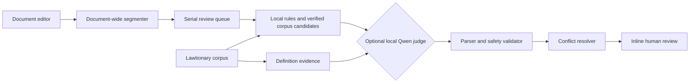

<p align="center">
  
</p>

<h1 align="center">AMT (Lawtionary)</h1>

<p align="center">
  A native macOS workspace for source-grounded Indonesian legal terminology lookup and human-reviewed document suggestions.
</p>

<p align="center">
  
  
  
</p>

AMT is an early-stage research/MVP application. It combines a versioned legal dictionary with a conservative document-review pipeline. The project is intentionally a retrieval and review tool—not a chatbot—and it does not automatically rewrite legal text.

> [!WARNING]
> AMT is not legal advice, a legal-accuracy certification system, or a replacement for a lawyer. Dictionary evidence and suggestion output must be reviewed by a qualified human before use.

## Contents

- [What is included](#what-is-included)
- [How the review pipeline works](#how-the-review-pipeline-works)
- [Source-grounded corpus](#source-grounded-corpus)
- [Getting started](#getting-started)
- [Testing](#testing)
- [Project layout](#project-layout)
- [Model and package dependencies](#model-and-package-dependencies)
- [Known limitations](#known-limitations)

## What is included

### Document workspace

- Dashboard navigation for imported and locally stored documents.
- Finder import for `.docx`, `.doc`, `.rtf`, `.md`, `.markdown`, and `.txt` files.
- Native AppKit rich-text editing with headings, inline styles, lists, undo/redo, and zoom controls.
- `.docx` export from the editor.
- Duplicate detection using the original file hash or normalized document content.
- JSON persistence in `~/Documents/AMT_Documents` through `DocumentStorageManager`.
- Analysis snapshots that are invalidated when the document content changes.

### Lawtionary Dictionary

- Bidirectional lookup: search for a legal term or search a description to find relevant terms.
- Lexical retrieval for exact, prefix, substring, and short term-shaped queries.
- Optional BM25 + multilingual E5 hybrid retrieval for longer reverse lookups.
- Definitions, source passages, source URLs, reference metadata, regulations, and regulation relations.
- Fail-closed behavior for unknown short terms: an unrelated semantic neighbor is not shown as an answer.
- Suggestion terminology candidates are restricted to verified, actionable corpus concepts.

The legacy `AMT/Dictionary/Resources/kamus_hukum.csv` parser and resource are retained for migration work, but CSV runtime lookup is currently disabled. The active runtime corpus is the versioned pack under `AMT/Resources/legal_corpus/`.

### Suggestion and review

- Sentence/paragraph segmentation across the complete document.
- Review categories for spelling, grammar, clarity, and legal terminology.
- Deterministic, Hybrid, and Qwen-only review modes.
- Inline source-range highlights with Accept and Dismiss actions; accepted changes remain user-controlled.
- Definition diagnostics that distinguish a likely definition from a non-definition and compare it with a source-grounded corpus definition.
- Review states including `NO_SUGGESTION`, `SUGGESTION`, and `NEEDS_REVIEW`.
- A Debug Panel with progress, queue state, candidate evidence, rejected output, definition assessments, and benchmark results.

## How the review pipeline works



The important boundary is candidate-first processing:

1. AMT creates bounded candidates from local rules, the Indonesian spell checker, or verified glossary evidence.
2. Qwen receives one supplied candidate and can only return `ACCEPT`, `REJECT`, or `NEEDS_REVIEW` for that candidate.
3. Parsers, locality checks, protected-term checks, modality/number checks, and conflict resolution run before a result becomes user-visible.
4. The system never accepts a model-invented replacement, source, legal citation, or glossary term.

The Hybrid mode tries the local model and uses deterministic recovery for bounded safe cases. The deterministic mode avoids downloading a Qwen model. Model-only mode is available for controlled comparisons, not as a production quality gate.

## Source-grounded corpus

The active bundled corpus is recorded in [`AMT/Resources/legal_corpus/manifest.json`](AMT/Resources/legal_corpus/manifest.json):

| Field | Current value |
| --- | ---: |
| Corpus version | `hukumonline-kamus-combined-deduplicated@78a2ab626c092662b0441c95904c353b2487b216` |
| Concepts | 8,272 |
| Actionable concepts for Suggestion | 2,238 |
| Regulations | 1,591 |
| Regulation relations | 315 |
| Source passages | 628 |
| Embedding model | `intfloat/multilingual-e5-small` |
| Embedding revision | `614241f622f53c4eeff9890bdc4f31cfecc418b3` |
| Embedding format | 384-dimensional, normalized, float16 little-endian |

The manifest also pins source hashes, file hashes, retrieval limits, and embedding order. The source dataset itself is expected outside this repository.

To regenerate a corpus pack from the companion dataset workspace:

```sh
python3 Scripts/export_amt_legal_corpus.py \
  --source-root /path/to/hukumonline-dataset \
  --output-root AMT/Resources/legal_corpus \
  --dataset-view combined-deduplicated
```

The exporter supports `hukumonline`, `combined`, and `combined-deduplicated` views. Embeddings are generated with the pinned multilingual E5 model unless `--skip-embeddings` is used with a compatible existing pack.

## Getting started

### Requirements

- macOS 26.5 or later.
- Xcode 26.6 or a compatible Xcode 26 toolchain.
- Apple Silicon is recommended for MLX inference.
- Network access on first use of a model-backed feature so pinned model artifacts can be downloaded from Hugging Face.

### Open the app

```sh
git clone https://github.com/MorpKnight/AMT.git
cd AMT
open AMT.xcodeproj
```

In Xcode, select the `AMT` scheme and a macOS destination, then run with `⌘R`.

### Try the main flows

1. Use the Document dashboard to import a supported document.
2. Open the document to edit its text and formatting.
3. Use the Dictionary tab for term lookup or reverse definition lookup.
4. Open the AI Connector Debug Panel from the View menu, or press `⌘⌥D`.
5. Select the current document or one of the built-in fixture samples, choose a review strategy, and select **Start review**.
6. Inspect the source span and evidence before accepting or dismissing a suggestion.

The Debug Panel can also toggle definition diagnostics from the View menu. These diagnostics are read-only and are not automatically applied to the document.

## Testing

The regular `AMTTests` suite is designed to run offline and does not download Qwen. Use an external DerivedData directory so build artifacts do not enter the repository.

```sh
validation_dir="$(mktemp -d /tmp/amt-build-validation.XXXXXX)"
xcodebuild \
  -project AMT.xcodeproj \
  -scheme AMT \
  -destination 'platform=macOS,arch=arm64' \
  -derivedDataPath "$validation_dir" \
  build \
  CODE_SIGNING_ALLOWED=NO
```

```sh
test_dir="$(mktemp -d /tmp/amt-test-validation.XXXXXX)"
xcodebuild \
  -project AMT.xcodeproj \
  -scheme AMT \
  -destination 'platform=macOS,arch=arm64' \
  -derivedDataPath "$test_dir" \
  test \
  CODE_SIGNING_ALLOWED=NO
```

For a lightweight repository check:

```sh
git diff --check
```

### Optional model benchmark

The Qwen benchmark is opt-in because it downloads a model and measures experimental model behavior. It is not part of the regular test run.

```sh
TEST_RUNNER_AMT_RUN_P011_MODEL_BENCHMARK=1 \
TEST_RUNNER_AMT_P011_MODEL_VARIANT=qwen35-base-4b \
TEST_RUNNER_AMT_P011_REPORT_PATH=/private/tmp/amt-p011-base-4b.json \
xcodebuild \
  -project AMT.xcodeproj \
  -scheme AMT \
  -configuration Debug \
  -destination 'platform=macOS,arch=arm64' \
  -derivedDataPath /private/tmp/AMT-P011-DerivedData \
  CODE_SIGNING_ALLOWED=NO \
  -only-testing:AMTTests/AIConnectorModelBenchmarkTests \
  test
```

The selected Qwen3.5 4B Base artifact is approximately 3.1 GB. Benchmark output is evidence for an experiment, not proof of legal correctness.

## Project layout

```text
AMT/
├── AMTApp.swift                         # App composition and commands
├── ContentView.swift                     # Root content view
├── Dashboard/                            # Document dashboard and persistence
├── Dictionary/                            # Lawtionary lookup and presentation
├── Features/AIConnector/                  # Review pipeline, models, rules, debug UI
├── RAG/                                   # Legacy/local retrieval integration
├── Resources/legal_corpus/                # Active versioned corpus pack
├── Shared/LegalKnowledge/                 # Corpus validation and semantic retrieval
└── Suggestion/                            # Rich-text editor and inline review UI
AMTTests/                                  # Deterministic unit and integration tests
Scripts/export_amt_legal_corpus.py        # Corpus pack exporter
training/                                 # Optional Kaggle QLoRA experiment
```

The active app composition is `AMTApp → ContentView → DashboardView`. `AMTDocument.swift` remains in the project as a document-model/FileDocument boundary, while the current dashboard flow uses `DashboardDocument` and `DocumentStorageManager` for its local JSON document store.

## Model and package dependencies

### Local model artifacts

Model artifacts are loaded lazily and cached locally at pinned revisions:

| Role | Model ID | Approximate download |
| --- | --- | ---: |
| Default Qwen judge | `mlx-community/Qwen3.5-4B-MLX-4bit` | 3.1 GB |
| Domain comparison | `morpknight/qwen3.5-4b-indonesian-legal-mlx-4bit` | 2.39 GB |
| Smaller comparison baseline | `mlx-community/Qwen3.5-2B-4bit` | 1.6 GB |
| Dictionary semantic retrieval | `intfloat/multilingual-e5-small` | corpus-dependent |
| Bounded spelling-candidate scorer | `citylighxts/TataKata` | corpus-dependent |

The current Swift implementation uses MLX and Hugging Face Swift packages. The exact package graph is pinned in [`Package.resolved`](AMT.xcodeproj/project.xcworkspace/xcshareddata/swiftpm/Package.resolved), including:

- `mlx-swift-lm` 3.31.4
- `swift-huggingface` 0.9.0
- `swift-transformers` 1.3.3

The optional training materials in [`training/README.md`](training/README.md) describe a separate Qwen3.5-4B + IGED QLoRA experiment. A training adapter is not automatically the production runtime model.

## Known limitations

- This is an experimental macOS application, not a production legal-review system.
- Corpus provenance improves traceability but does not guarantee that a definition or retrieved match is legally complete or current.
- Suggestions are intentionally bounded and may be rejected, skipped, or marked `NEEDS_REVIEW`.
- Qwen output is parsed and guarded; the model is not allowed to invent legal sources or rewrite a clause freely.
- Definition diagnostics are source-grounded review aids, not legal conclusions.
- Model-backed review, semantic reverse lookup, and the TataKata spelling pilot may require large first-run downloads.
- The importer targets text and rich-text document formats listed above; scanned-PDF/OCR workflows are outside the current importer boundary.
- Thresholds, prompt versions, model selections, and corpus contents are experimental and may change between revisions.

## Resources

- [`AMT/Features/AIConnector/`](AMT/Features/AIConnector/) — review models, candidate construction, validation, and debug panel.
- [`AMT/Dictionary/`](AMT/Dictionary/) — dictionary models, store, and views.
- [`AMT/Shared/LegalKnowledge/`](AMT/Shared/LegalKnowledge/) — versioned corpus validation and semantic retrieval.
- [`Scripts/export_amt_legal_corpus.py`](Scripts/export_amt_legal_corpus.py) — reproducible corpus-pack export.
- [`training/README.md`](training/README.md) — optional training experiment notes.
