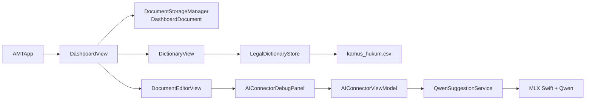

# AMT

**AMT (Lawtionary)** adalah aplikasi macOS awal untuk membantu penulisan dokumen hukum Indonesia. Aplikasi ini menggabungkan editor dokumen sederhana, kamus istilah hukum berbasis sumber, dan eksperimen suggestion berbasis model bahasa lokal.

> [!WARNING]
> AMT masih berada pada tahap MVP/early development. Hasil Dictionary dan Suggestion bukan nasihat hukum, bukan validasi hukum otomatis, dan tetap memerlukan review manusia.

## Fitur saat ini

- **Dashboard dokumen**
  - Membuat, membuka, mencari, dan menghapus dokumen.
  - Menyimpan dokumen secara lokal di folder `Documents/AMT_Documents` sebagai JSON.
  - Mengimpor `.docx`, `.doc`, `.rtf`, dan `.txt` melalui Finder. Isi file diubah menjadi teks biasa untuk kebutuhan editor saat ini.
- **Dictionary / Lawtionary**
  - Memuat `AMT/Dictionary/Resources/kamus_hukum.csv` sebagai resource aplikasi.
  - Mencari berdasarkan istilah atau bagian dari pengertian.
  - Menampilkan pengertian, peraturan, judul peraturan, dan tautan sumber jika tersedia.
- **Suggestion eksperimental**
  - Meninjau teks dokumen menggunakan `mlx-community/Qwen3.5-2B-4bit` melalui MLX Swift.
  - Inferensi berjalan lokal setelah model selesai diunduh dan disimpan di cache Hugging Face.
  - Mendukung streaming output, Cancel, Retry, dan pilihan thinking mode.
  - Menyediakan tujuh dummy sample untuk smoke test perilaku awal.

## Arsitektur ringkas



`AMTApp` membuat `QwenSuggestionService` dan `LegalDictionaryStore`, lalu meneruskannya secara eksplisit ke view yang membutuhkan. Kode baru dikelompokkan berdasarkan fitur, sedangkan model dokumen dan storage dashboard masih berada pada boundary yang digunakan project saat ini.

## Cara kerja Dictionary

Dictionary saat ini bukan chatbot, bukan RAG, dan tidak menggunakan embedding. Semua entry CSV dimuat ke memori ketika aplikasi dimulai, kemudian query dinormalisasi dan dicocokkan secara deterministik.

Urutan prioritas pencarian adalah:

1. Istilah sama persis.
2. Istilah diawali query.
3. Istilah mengandung query.
4. Pengertian mengandung query.
5. Ada token query yang cocok dengan istilah atau pengertian.

Pencarian mengabaikan perbedaan huruf besar-kecil, diakritik, dan spasi berlebih. Hasil dibatasi hingga 30 entry. Regex hanya digunakan untuk merapikan whitespace, bukan sebagai mesin pencarian semantik.

Format utama CSV yang digunakan:

```text
istilah,pengertian,undang_undang,uu,url,status
```

Entry dengan `status` selain `OK` dilewati. Jika resource CSV tidak dapat dimuat, aplikasi menggunakan beberapa entry preview agar layar Dictionary tetap dapat dibuka.

## Cara kerja Suggestion

Suggestion menggunakan prompt sederhana untuk meninjau ejaan, tata bahasa, kejelasan, dan konsistensi istilah tanpa mengubah makna hukum. Model tidak digunakan sebagai sumber hukum dan output ditampilkan apa adanya setelah reasoning internal disembunyikan.

Konfigurasi penting saat ini:

| Komponen | Nilai |
| --- | --- |
| Model | `mlx-community/Qwen3.5-2B-4bit` |
| Revision | `674aaa7240b91e8012fcad5d791b7dfe5ba90207` |
| Input dokumen | Maksimal 4.096 token, dihitung dengan tokenizer Qwen |
| Output non-thinking | Maksimal 4.096 token |
| Output thinking | Maksimal 2.048 token |
| Thinking default | Off |
| Generation | Streaming dan dapat dibatalkan |

Model tidak dibundel ke repository. Pada penggunaan pertama, aplikasi membutuhkan koneksi internet untuk mengunduh model. Setelah itu, model digunakan dari cache lokal. Teks dokumen tidak dikirim ke API LLM eksternal oleh implementasi ini.

## Persyaratan

- macOS dengan environment Xcode yang mendukung target project `macOS 26.5`.
- Xcode dan Git.
- Mac Apple Silicon direkomendasikan untuk menjalankan Suggestion dengan MLX.
- Koneksi internet pada penggunaan pertama Suggestion untuk mengunduh model.

Dependency Swift yang dipin dan disimpan pada `AMT.xcodeproj/project.xcworkspace/xcshareddata/swiftpm/Package.resolved`:

- [mlx-swift-lm](https://github.com/ml-explore/mlx-swift-lm) `3.31.4`
- [swift-huggingface](https://github.com/huggingface/swift-huggingface) `0.9.0`
- [swift-transformers](https://github.com/huggingface/swift-transformers) `1.3.3`

Produk yang digunakan target AMT adalah `MLXLLM`, `MLXLMCommon`, `MLXHuggingFace`, `HuggingFace`, dan `Tokenizers`.

## Menjalankan aplikasi

1. Clone repository:

   ```bash
   git clone https://github.com/MorpKnight/AMT.git
   cd AMT
   ```

2. Buka `AMT.xcodeproj` dengan Xcode.
3. Pilih scheme `AMT` dan destination macOS.
4. Jalankan dengan `⌘R`.
5. Pilih **Dictionary** pada sidebar untuk mencari istilah atau pengertian.
6. Pilih dokumen pada dashboard untuk membuka editor.
7. Pada panel **Suggestion — Eksperimental**, pilih sumber input, opsional pilih dummy sample, lalu tekan **Run**.

Pada Run pertama, tunggu proses download dan loading model selesai. Run berikutnya menggunakan cache lokal selama cache masih tersedia.

## Build dari command line

Gunakan DerivedData di luar repository dan nonaktifkan code signing untuk validasi lokal:

```bash
xcodebuild \
  -project AMT.xcodeproj \
  -scheme AMT \
  -configuration Debug \
  -sdk macosx \
  -arch arm64 \
  -derivedDataPath /tmp/amt-build-debug \
  CODE_SIGNING_ALLOWED=NO \
  build
```

Untuk memvalidasi Release, ganti `Debug` menjadi `Release` dan gunakan DerivedData berbeda, misalnya `/tmp/amt-build-release`.

Pemeriksaan whitespace yang tersedia:

```bash
git diff --check
```

Repository belum memiliki test target, formatter, linter, atau CI workflow. Karena itu, build Debug/Release dan smoke test manual merupakan validasi utama saat ini.

## Struktur project

```text
AMT/
├── AMTApp.swift
├── Dashboard/
│   ├── Models/
│   ├── Services/
│   └── Views/
├── Dictionary/
│   ├── Resources/
│   ├── Services/
│   └── Views/
├── Features/AIConnector/
│   ├── Models/
│   ├── Services/
│   ├── ViewModels/
│   └── Views/
├── Suggestion/Views/
├── Components/Sidebar/
└── Info.plist
```

## Batasan MVP

- Dictionary masih menggunakan lexical search; belum mendukung typo correction, stemming, sinonim, atau semantic retrieval.
- Dictionary belum terhubung dengan Suggestion untuk mengambil kandidat istilah secara otomatis.
- Suggestion belum menghasilkan suggestion cards dengan accept/reject dan belum mengubah isi dokumen.
- Thinking mode pada model kecil dapat berhenti sebelum jawaban final; aplikasi akan menampilkan error dan menyarankan non-thinking mode.
- Editor saat ini menyimpan teks biasa. Toolbar formatting masih berupa prototype dan belum menyimpan rich-text formatting.
- Import `.docx`/`.doc` berfokus pada ekstraksi teks; export kembali ke `.docx` belum tersedia.
- Dataset dan output model belum membuktikan ketepatan hukum. Kasus ambigu atau berdampak pada hak dan kewajiban harus diperlakukan sebagai `needs review` oleh manusia.

## Arah pengembangan berikutnya

1. Evaluasi Dictionary dengan query istilah, pengertian, typo, dan paraphrase yang direview manusia.
2. Tambahkan fuzzy/BM25 retrieval sebelum mempertimbangkan semantic embedding.
3. Hubungkan retrieval Dictionary dengan Suggestion agar model menerima kandidat istilah beserta sumbernya.
4. Pisahkan hasil grammar, istilah, dan isu substantif dengan status review yang jelas.
5. Tambahkan test target dan fixture evaluasi untuk preservasi angka, tanggal, defined terms, serta larangan mengarang sumber.

## Referensi teknis

- [MLX Swift LM](https://github.com/ml-explore/mlx-swift-lm)
- [Swift Hugging Face](https://github.com/huggingface/swift-huggingface)
- [Swift Transformers](https://github.com/huggingface/swift-transformers)
- [Qwen3.5 model card](https://huggingface.co/Qwen/Qwen3.5-2B)
- Sumber setiap entry Dictionary ditentukan oleh kolom `url` pada `kamus_hukum.csv`.
