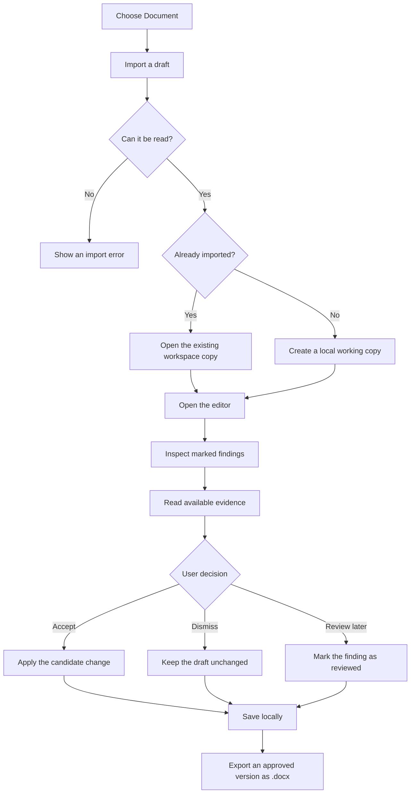
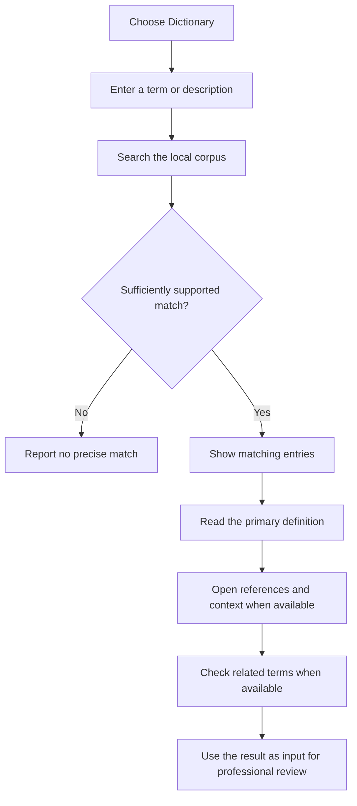

<div align="center">
  
  <h1>Lawtionary</h1>
  <p>Local-first macOS workspace for reviewing Indonesian legal drafts and checking legal terminology.</p>

  <a href="https://github.com/MorpKnight/AMT/releases"></a>
  <a href="https://github.com/MorpKnight/AMT/blob/main/README.md"></a>
  <a href="https://github.com/MorpKnight/AMT/blob/main/README.md"></a>
</div>

Lawtionary helps legal teams keep a draft, a review queue, and source-backed terminology in one macOS application. It combines two focused workflows:

- **Document** imports a draft, keeps a local working copy, highlights candidates for review, and exports a user-approved `.docx` result.
- **Dictionary** searches a bundled, versioned Indonesian legal corpus for definitions, references, regulatory context, and related terms when available.

> [!WARNING]
> Lawtionary is an MVP work-assistance tool, not legal advice or a legal correctness certificate. A suggestion is a candidate for professional review. The user decides what changes, if any, are applied to a document.

## Contents

- [What Lawtionary does](#what-lawtionary-does)
- [Document workflow](#document-workflow)
- [Dictionary workflow](#dictionary-workflow)
- [Local-first boundaries](#local-first-boundaries)
- [Getting started](#getting-started)
- [Developer workflow](#developer-workflow)
- [Documentation](#documentation)

## What Lawtionary does

| Workflow | Purpose | Result |
| --- | --- | --- |
| **Document** | Review a draft without sending its content to a hosted inference service. | Imported text, marked findings, available evidence, human decisions, and Word export. |
| **Dictionary** | Look up Indonesian legal terminology from the bundled corpus. | Definitions, references, regulatory information, and related terms when the corpus contains them. |

The workflows complement each other without pretending to be the same thing. Dictionary provides terminology evidence; Document keeps the draft and its review decisions under the user's control.

## Document workflow

Document currently handles Word, RTF, HTML, Markdown, and plain-text inputs (`.docx`, `.doc`, `.rtf`, `.html`, `.htm`, `.md`, `.markdown`, and `.txt`). The app imports a source into its local workspace and leaves the original file at its initial location.



Review is deliberately candidate-first:

- findings are shown for inspection rather than silently rewriting the draft;
- the user can accept, dismiss, or mark each finding as reviewed;
- available references and reasons are shown with the finding when they exist;
- edits can make an earlier analysis stale, so run the review again before relying on it;
- legal-risk changes can be routed to a review state instead of being treated as safe automatic replacements.

The workspace is for reviewing existing drafts. It is not intended to generate contracts from scratch, replace large sections automatically, or decide the legal effect of a clause.

## Dictionary workflow

Dictionary searches a versioned corpus bundled with the application. It starts with literal and prefix retrieval, then can load a local semantic-retrieval component for longer descriptions when lexical matching is not enough.



An entry may include a primary definition, contextual alternatives, legal references, source passages, regulatory status or history, and related terms. These fields are conditional; the app does not invent missing sources or fill gaps with a free-form chatbot answer. A missing result means that the active corpus did not find a sufficiently precise match, not that the term never appears in law.

> [!NOTE]
> The first semantic search can take longer because the local retrieval model may need to be loaded. Model-assisted review can also download model components on first use.

## Local-first boundaries

- Document analysis is designed to run on the device using local rules and an optional local Qwen model-assisted pipeline; this repository does not depend on a hosted inference server for the review path.
- The bundled dictionary and its retrieval index are local application resources. Some external source links, package resolution, or first-run model downloads may still require network access.
- Working copies are stored under `~/Documents/AMT_Documents`. Deleting a workspace record removes AMT's preserved copy and metadata; it does not delete the original file from its initial location.
- Local processing reduces the need to upload sensitive drafts, but it does not replace an organization's own device, access-control, backup, or confidentiality policies.

## Getting started

### Requirements

- macOS 26.5 or later.
- Xcode 26 or a compatible Xcode toolchain.
- Apple Silicon is recommended for model-assisted review.

### Run the app

```sh
git clone https://github.com/MorpKnight/AMT.git
cd AMT
open AMT.xcodeproj
```

In Xcode, select the `AMT` scheme, choose a macOS destination, and run with `⌘R`.

On first use:

1. Open **Document** and import a supported draft.
2. Inspect findings one by one and make the final decision for each.
3. Export the approved working copy as `.docx` when needed.
4. Open **Dictionary** and search for a term or a short description.
5. Read the available definition and sources before using the result in professional work.

## Developer workflow

### Project map

```text
AMT/
├── Dashboard/                 # Document list, import, storage, and workspace state
├── Suggestion/                # Rich-text editor and review UI
├── Dictionary/                # Legal-term search and detail views
├── Features/AIConnector/      # Bounded, reviewable document analysis
├── Shared/LegalKnowledge/     # Corpus loading and retrieval services
├── Resources/legal_corpus/    # Bundled dictionary data and manifest
└── AMTApp.swift               # SwiftUI application entry point
AMTTests/                      # Deterministic and integration tests
Scripts/export_amt_legal_corpus.py
```

The active corpus version and integrity metadata are recorded in [`manifest.json`](AMT/Resources/legal_corpus/manifest.json). The manifest is the source for the bundled corpus version, retrieval settings, counts, and file hashes.

### Build

Use DerivedData outside the repository so generated artifacts do not enter the working tree:

```sh
validation_dir="$(mktemp -d /tmp/amt-build-validation.XXXXXX)"
xcodebuild \
  -project AMT.xcodeproj \
  -scheme AMT \
  -destination 'platform=macOS,arch=arm64' \
  -derivedDataPath "$validation_dir" \
  build \
  CODE_SIGNING_ALLOWED=NO
```

### Test

```sh
test_dir="$(mktemp -d /tmp/amt-test-validation.XXXXXX)"
xcodebuild \
  -project AMT.xcodeproj \
  -scheme AMT \
  -destination 'platform=macOS,arch=arm64' \
  -derivedDataPath "$test_dir" \
  test \
  CODE_SIGNING_ALLOWED=NO
```

The regular suite is intended to run without downloading Qwen. Model benchmark tests are opt-in and provide experimental evidence; they do not prove legal correctness or replace a manual smoke test.

Before opening a pull request, check the patch for whitespace errors:

```sh
git diff --check
```

## Documentation

- [Document product audit](docs/document-product-audit-2026-09-08.md) — current behavior, known limitations, and validation boundaries.
- [Document future development](docs/document-future-development.md) — proposed roadmap; future sections are not automatically available in the current app.
- [Bundled corpus manifest](AMT/Resources/legal_corpus/manifest.json) — version and integrity metadata for the local dictionary.
- [Repository instructions](AGENTS.md) — architecture, change boundaries, and validation commands for contributors and coding agents.

<div align="center">
  <sub>Lawtionary — review locally, decide deliberately.</sub>
</div>
