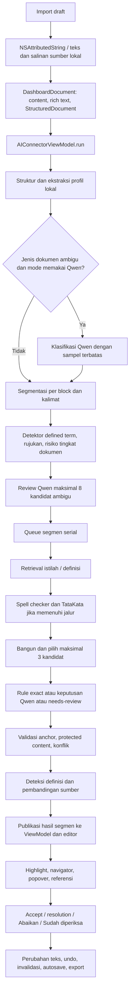
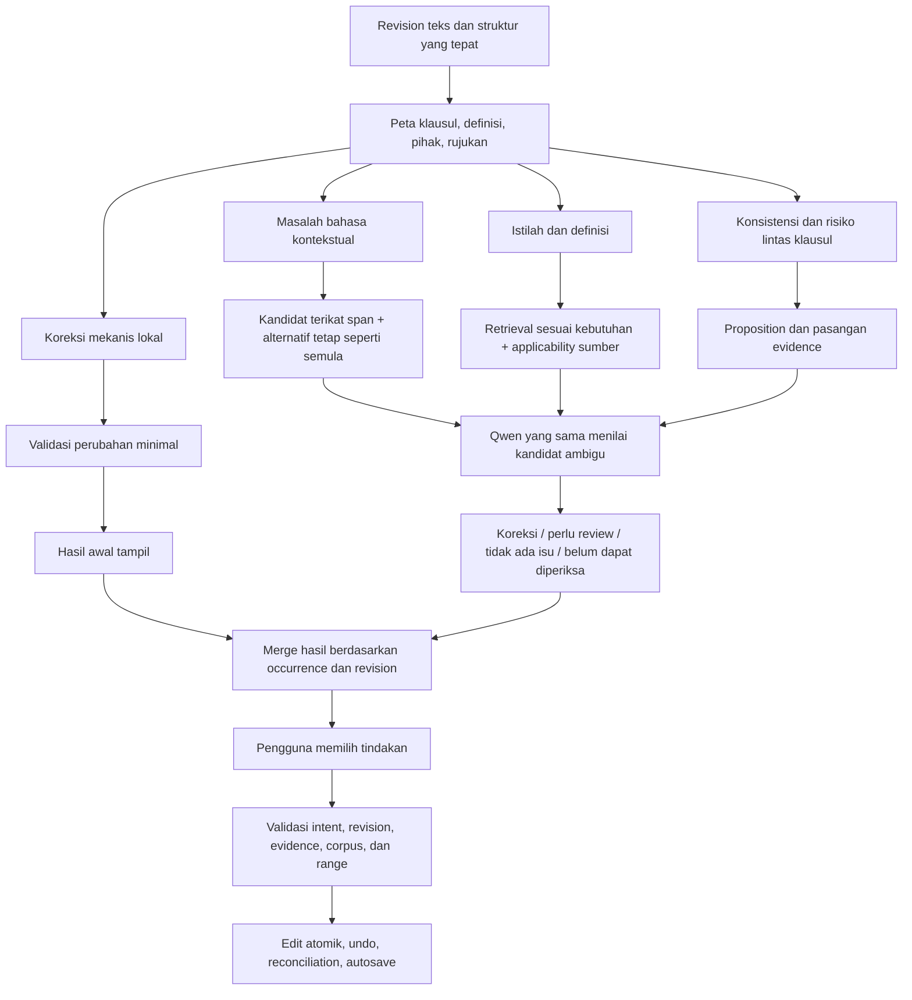

# Audit Produk Document — Deteksi, Analisis, dan Rekomendasi

Tanggal: 8 September 2026

Branch: `gi/model-improvement`

Baseline kode: `c1b61911889bf836c14d7bb10e27b59080029c13`

Status: audit dan rekomendasi; perbaikan produk dalam dokumen ini belum diterapkan.

## 1. Kesimpulan untuk keputusan produk

Fondasi Document sudah berguna: pemrosesan lokal, saran berbasis kandidat,
anchor UTF-16, pemisahan anotasi dan perubahan, referensi sumber, serta kendali
Accept/Abaikan pada pengguna. Fondasi ini perlu dipertahankan.

Namun, Document belum layak diposisikan sebagai pemeriksa bahasa dan
konsistensi kontrak yang luas dan dapat diandalkan. Batas utamanya bukan
semata-mata ukuran Qwen. Ada kesalahan logika sebelum model, konteks yang
hilang, pilihan perubahan yang belum sepenuhnya dibuktikan, dan evaluasi yang
belum mengukur perilaku produk secara lengkap. Menambah panggilan model pada
alur yang sama berpotensi menambah waktu tanpa memperbaiki akar masalah.

Tiga jawaban utama dari audit ini:

1. **Bagaimana seharusnya dokumen diperiksa?** Bentuk representasi dokumen yang
   menjaga klausul dan hubungan makna, temukan bukti masalah, bedakan koreksi
   mekanis dari pertimbangan kontekstual, lalu validasi perubahan sebelum
   editor menyentuh teks. Jalur bahasa, definisi, dan konsistensi memiliki
   kebutuhan bukti berbeda.
2. **Bagaimana produk dikembangkan?** Stabilkan hasil yang sudah dijanjikan,
   tetapkan cakupan pemeriksaan yang terlihat oleh lawyer, benahi integrasi
   review/edit/export, dan ukur pekerjaan yang benar-benar terbantu. Prioritas
   berikutnya adalah keandalan alur kerja, bukan jumlah kategori highlight.
3. **Bagaimana akurasi ditingkatkan tanpa dataset/model baru?** Perbaiki
   segmentasi, negasi/modalitas, kandidat dan ranking, applicability sumber,
   pemeriksaan alternatif termasuk mempertahankan teks, invalidasi, dan
   evaluasi. Gunakan Qwen yang sama untuk keputusan terbatas atas input yang
   lebih tepat. Besarnya peningkatan tetap perlu diukur.

Urutan terpenting: tutup celah perubahan dan hasil keliru → perbaiki unit
analisis dan detektor → perbaiki evaluasi → optimalkan scheduling/cache →
perluas kemampuan bahasa secara terukur.

## 2. Ruang lingkup, batas, dan cara membaca bukti

### 2.1 Batas yang disepakati

- Audit berfokus pada MVP **Document**. UI, API, dan perilaku pencarian
  **Dictionary tidak diubah**.
- Tidak mensyaratkan dataset baru, pengunduhan corpus baru, fine-tuning,
  pergantian bobot model, model tambahan, atau layanan AI cloud.
- Corpus yang ada boleh dibaca melalui adapter khusus Document. Penyaringan,
  ranking, dan penyajian untuk Document boleh diperbaiki tanpa mengubah
  pencarian Dictionary.
- Dokumen tetap draft milik lawyer. Tidak ada pembuatan kontrak dari awal,
  penggantian massal, atau perubahan tanpa persetujuan pengguna.
- Revisi rule, prompt, lifecycle, dan evaluator merupakan perubahan software;
  tidak memerlukan perubahan model. Memeriksa ulang ekspektasi fixture yang
  sudah tersedia juga tidak sama dengan menambah dataset pelatihan.
- Contoh sintetis dalam audit adalah probe perilaku, bukan sumber hukum atau
  tambahan corpus produk.

### 2.2 Tingkat kepastian

| Label | Arti |
| --- | --- |
| Terbukti melalui probe | Service/kode aktual dijalankan pada input sintetis dan hasil yang disebutkan teramati |
| Terlihat pada kode | Cabang/alur aktual menunjukkan celah; kejadian penuh di UI atau model belum direproduksi |
| Keterbatasan desain | Perilaku memang dibatasi implementasi saat ini, tetapi membatasi manfaat produk |
| Perlu pengukuran | Dampak numerik, latency model, atau kualitas pada dokumen panjang belum diukur dalam audit ini |

Audit membaca jalur import, struktur, context profile, segmentasi,
candidate-first processing, definition/risk review, resolution, incremental
planner, editor mutation, snapshot, serta Phase 0/8 diagnostics. Riwayat proyek
dipakai untuk memahami tujuan; kesimpulan implementasi diverifikasi dari kode
baseline di atas. Worktree bersih saat audit dimulai.

Roadmap [Document sebelumnya](document-future-development.md) masih mencatat
baseline Phase 0–2. Ia berguna untuk keputusan historis, tetapi tidak boleh
dibaca sebagai inventaris kemampuan aktual Phase 0–8. Keberadaan sebuah fase
atau file tidak otomatis berarti seluruh acceptance fase tersebut terpenuhi.

## 3. Alur aktual Document

### 3.1 Dari import sampai hasil review



Catatan penting pada diagram:

- Cabang detektor risiko tidak selalu memanggil Qwen. Maksimal delapan kandidat
  yang ambigu diperiksa serial; temuan struktural langsung memakai hasil lokal.
- `run()` terlebih dahulu membangun seed struktur/profil/segmentasi untuk plan,
  lalu context coordinator membangunnya lagi ketika cache persiapan tidak hit.
- Pemeriksaan normal memakai hybrid, Qwen 3.5 Base 4B, greedy, thinking mati.
- Qwen **tidak membaca seluruh dokumen sekaligus**. Ia mendapat sampel
  klasifikasi, target segmen, konteks terbatas, dan kandidat/evidence terkait.
- Qwen candidate review tidak membuat koreksi dari nol. Bila kandidat kosong,
  pemeriksaan kandidat mengembalikan `noSuggestion`; definition review masih
  mempunyai jalur tersendiri.
- Challenge penolakan kandidat dimatikan pada composition produk. Satu repair
  format masih tersedia untuk kegagalan yang dianggap dapat dipulihkan.
- Hasil segmen dipublikasikan setelah definition analysis segmen selesai.
  Exact-rule melewati candidate Qwen, tetapi belum memiliki publikasi awal
  tersendiri sebelum semua tahap yang mendahuluinya.

### 3.2 Teknologi dan perannya

| Komponen | Teknologi aktual | Peran dan batas |
| --- | --- | --- |
| Import dan editor | AppKit `NSAttributedString`, `NSTextView`, SwiftUI | Rich text dan perubahan lokal; analisis memakai teks editor, bukan seluruh struktur OOXML asli |
| Workspace | `DashboardDocument`, JSON, private persistence actor | Salinan lokal, debounce save 750 ms, revision save, retry; ini jalur dashboard aktual |
| Struktur | `AIConnectorDocumentStructureBuilder`, metadata `StructuredDocument`, regex | Heading, block, penomoran, range; fallback konservatif saat metadata tidak cocok |
| Segmentasi | NaturalLanguage `NLTokenizer`, bahasa Indonesia | Kalimat/kata; hitungan kata bukan token subword Qwen |
| Aturan exact | `AIConnectorRulePack.json` | Empat transformasi; bukan grammar checker umum |
| Kandidat ejaan | AppKit `NSSpellChecker`, language `id` | Kandidat kamus sistem, dengan filter dan batas ketat |
| Penilaian ejaan | `citylighxts/TataKata`, runtime MLX lokal | Mean pseudo-log-likelihood, window maksimal 64 WordPiece, delta minimal 0,25 nats; bukan penilai ketepatan hukum |
| Retrieval | Corpus lokal, BM25, reciprocal-rank fusion, E5 | Mengambil kandidat; tidak membuktikan kesetaraan makna atau keberlakuan pada kontrak |
| Embedding | `intfloat/multilingual-e5-small`, 384 dimensi; embedding corpus float16 | Model query dan indeks corpus dipatok revision; tidak diganti dalam rekomendasi ini |
| Keputusan model | `mlx-community/Qwen3.5-4B-MLX-4bit`, MLX Swift LM `ChatSession`, structured tool output | Memilih keputusan atas kandidat; ada jalur klasifikasi, definisi, risiko, dan resolution |
| Review boundary | Validator, conflict resolver, anchor UTF-16 + SHA-256 | Memeriksa lokasi, perubahan minimal, protected content, dan bukti sebelum mapping |
| Review UI | Suggestion actionable, annotation read-only, navigator, popover | Lawyer menerima perubahan atau memeriksa bukti; definition match opsional |
| Reuse | Incremental planner dan cache in-memory/LRU | Ada fondasi reuse, tetapi beberapa batas invalidasi dan pengukuran belum memenuhi rancangan |
| Evaluasi | XCTest, Phase 0 observability, Phase 8 quality package/evaluator | Test implementasi dan mekanisme evaluasi; belum menjadi bukti kualitas rilis |

Manifest corpus saat audit mencatat 2.589 concept dan 1.666 actionable concept.
Angka tersebut adalah metadata corpus, bukan persentase akurasi Document.
Tidak semua sumber yang dapat ditampilkan Dictionary memenuhi syarat untuk
menghasilkan perubahan dokumen.

### 3.3 Apa yang sebenarnya mampu ditemukan saat ini?

| Jenis pemeriksaan | Mekanisme aktual | Batas produk |
| --- | --- | --- |
| Ejaan exact | `memasukan`, `di simpan`, `ditanda tangani` | Menangani pola tersebut, bukan seluruh variasi ejaan/imbuhan |
| Tata bahasa exact | `wajib untuk` → `wajib` | Lebih dekat ke penyederhanaan frasa; tidak membuktikan kemampuan tata bahasa umum |
| Ejaan lain | Spell checker → TataKata → Qwen | Tidak menangani semua real-word error, multi-edit typo, atau kesalahan struktur kalimat |
| Terminology | Uraian yang mirip definisi → istilah corpus | Cenderung mencari peluang mengganti uraian dengan istilah; belum identik dengan menemukan istilah yang salah konteks |
| Definisi | Pola eksplisit/retrieval → lexical atau Qwen comparison | Ada celah negasi, pemilihan sumber, dan batas body |
| Defined term | Deklarasi/alias/usage berbasis pola | Ada false positive penggunaan umum dan casing |
| Rujukan internal | Regex dan indeks target heading | Ada false positive angka dan false negative rujukan campuran |
| Risiko | Pola pihak/tindakan/objek, modalitas, kondisi, pengakhiran | Heuristik sempit; beberapa pola belum membedakan larangan dari pemberian hak |

## 4. Temuan audit dan dampaknya

Prioritas **P1** berarti perlu diselesaikan sebelum kemampuan terkait
diandalkan dalam rilis produk. **P2** berarti penting untuk keandalan,
performa, atau perluasan berikutnya. Prioritas ini bukan penilaian dampak
hukum terhadap kontrak tertentu.

### DOC-01 — Negasi dapat hilang dalam pembandingan definisi lokal

**P1 · Terbukti melalui probe.**

`contentTokens()` menghapus `tidak`, `dapat`, `dan`, serta `atau` sebagai
stopword. `lexicalAlignment()` kemudian dapat menganggap token sama atau
coverage tinggi sebagai `.matches`.

Probe dengan sumber sintetis:

```text
Sumber: Data Uji adalah informasi yang dapat diidentifikasi.
Draft:  Data Uji adalah informasi yang tidak dapat diidentifikasi.
Aktual pada deterministic: matches.
```

Negasi berlawanan dapat terlihat sebagai definisi selaras. Ini tetap masalah
meskipun annotation hijau opsional dan teks tidak otomatis diganti. Jalur
fallback lokal juga perlu memperhatikan invariant yang sama.

**Perbaikan:** pertahankan negasi, modalitas, kuantifier, konjungsi,
kondisi, serta scope-nya saat membandingkan definisi. Kecocokan leksikal yang
tidak identik dan belum dibuktikan cukup menghasilkan `needsReview`.
Normalisasi aman untuk exact match dibatasi pada whitespace dan variasi tanda
baca yang tidak mengubah operator makna.

Bukti: [lexicalAlignment](../AMT/Features/AIConnector/Services/AIConnectorDefinitionAnalyzer.swift#L412),
[stopWords](../AMT/Features/AIConnector/Services/AIConnectorDefinitionAnalyzer.swift#L585).

### DOC-02 — Sebagian opsi ganti istilah aktif sebelum kecocokan body terbukti

**P1 · Terlihat pada kode.**

Loop awal `resolve()` membuat opsi `.replaceTerm` ketika nama istilah berbeda
dengan kandidat dan sumber eligible. Jalur ini tidak mensyaratkan hasil
`TERM_FITS` atau exact body match. Jalur reverse retrieval berikutnya justru
memiliki persyaratan itu. Dengan demikian, sumber hasil assessment dapat
melewati pemeriksaan yang lebih ketat pada reverse candidate.

`useDefinition` juga harus membuktikan bahwa sumber memang mendefinisikan
istilah deklarasi yang sedang dipilih, bukan sekadar kandidat semantic yang
tersedia. Keberlakuan sumber saja belum menjawab applicability terhadap
kontrak/section tersebut.

**Perbaikan:** semua jalan menuju kedua jenis edit melewati eligibility policy
yang sama. Ganti body memerlukan identitas istilah/scope yang sesuai; ganti
istilah memerlukan kesesuaian body yang dibuktikan. Pilihan source tetap
eksplisit, tanpa default. Contract-defined override memakai bukti dari
deklarasi/section, bukan hanya kata pemicu dalam satu kalimat.

Bukti: [pembuatan opsi awal](../AMT/Features/AIConnector/Services/AIConnectorDefinitionResolutionService.swift#L36),
[jalur reverse dengan validasi](../AMT/Features/AIConnector/Services/AIConnectorDefinitionResolutionService.swift#L173),
[contract/source eligibility](../AMT/Features/AIConnector/Services/AIConnectorDefinitionResolutionService.swift#L485).

### DOC-03 — Validasi lengkap Apply terjadi setelah editor berubah

**P1 · Terlihat pada kode; stale UI callback belum diuji melalui UI dalam audit.**

`applyDefinitionResolution()` mengecek status opsi dan kesamaan teks target,
lalu menjalankan `insertText` dan persistence rich text. Setelah itu callback
memanggil `reconcileAfterDefinitionResolution()`, yang baru memeriksa
fingerprint dokumen, corpus, keberadaan opsi, serta anchor resolution.
Jika gagal, view mereset metadata hasil, bukan membatalkan perubahan teks.

Ini menyisakan celah ketika teks target masih sama tetapi konteks/revision
atau sumber tidak lagi cocok. Jalur Accept suggestion juga perlu menjamin
item masih aktif dan konteksnya valid sebelum mutasi, bukan hanya string pada
range yang kebetulan tetap sama.

**Perbaikan:** ViewModel memproses intent `prepare/validate edit` terlebih
dahulu. Hanya edit yang lolos seluruh invariant diteruskan ke adapter
`NSTextView`; adapter menerapkan persis satu range, mempertahankan atribut,
merekam undo, lalu melakukan reconciliation. Kegagalan validasi berarti teks
tidak berubah. Uji melalui boundary editor yang sama dengan produk.

Bukti: [mutasi editor](../AMT/Suggestion/Views/HighlightedDocumentTextEditor.swift#L764),
[callback view](../AMT/Suggestion/Views/DocumentEditorView.swift#L310),
[validasi sesudah mutasi](../AMT/Features/AIConnector/ViewModels/AIConnectorViewModel.swift#L1931).

### DOC-04 — Konteks kalimat dan satuan segmentasi belum tepat

**P1 · Konteks terbukti melalui probe; batas token terlihat pada kode.**

Overload struktur memilih previous/next dari block lain. Semua kalimat di
dalam block yang sama mendapat tetangga block tersebut, bukan kalimat
sebelum/sesudahnya dalam paragraf.

```text
Paragraf: Penyedia menyerahkan laporan. Laporan tersebut wajib disimpan.
          Salinannya dapat diperiksa.

Target:   Laporan tersebut wajib disimpan.
Aktual:   previous/next menunjuk paragraf sebelum/sesudah block ini.
Hilang:   Penyedia menyerahkan laporan. / Salinannya dapat diperiksa.
```

Struktur juga tetap dipecah dengan sentence tokenizer; menjaga definisi,
kondisi/pengecualian, atau pengantar list dalam satu unit belum menjadi aturan
segmentasi khusus. Batas awal 512 memakai token kata NaturalLanguage,
sementara pemeriksaan akhir memakai tokenizer Qwen. Segmen dapat lolos
penilaian awal lalu ditolak sesudah model dimuat.

**Perbaikan:** gunakan unit klausul dengan range asli sebagai unit utama;
turunkan sentence target beserta konteks intrablock, parent clause, dan item
list terkait. Pisahkan tabel per cell sambil membawa heading baris/kolom jika
tersedia. Preflight token memakai tokenizer yang sama dengan inference;
estimasi lokal boleh konservatif, tetapi harus dibedakan dari hitungan final.

Bukti: [struktur-aware segmentation](../AMT/Features/AIConnector/Services/LegalTextSegmenter.swift#L17),
[split dan word count](../AMT/Features/AIConnector/Services/LegalTextSegmenter.swift#L215),
[token check Qwen](../AMT/Features/AIConnector/Services/QwenSuggestionService.swift#L986).

### DOC-05 — Cakupan kandidat menjadi batas recall sebelum Qwen

**P1 · Keterbatasan desain.**

Rule pack berisi empat aturan exact. Spell checker membatasi dua kata salah,
enam guess per kata, edit distance satu. TataKata dan candidate builder
akhirnya mengambil satu kandidat spelling dinamis; ranker mengambil maksimal
tiga kandidat non-overlap per segmen. Kandidat keempat dapat tidak tampil
meskipun independen dan benar.

Ketika tidak ada kandidat, Qwen candidate review tidak dijalankan. Label
`model-only` pada jalur produk Phase 2 tetap tidak berarti model melakukan
proofreading bebas: exact rule masih memiliki routing lokal.

**Perbaikan:** pisahkan batas jumlah kandidat yang ditemukan, jumlah yang
dinilai model per giliran, dan jumlah hasil yang boleh dipublikasikan.
Antrekan seluruh occurrence independen; jika ada batas waktu, laporkan bagian
yang belum diperiksa. Perluas transformasi bahasa dengan precondition yang
dapat diuji, bukan daftar hard-code koreksi untuk setiap contoh.

`wajib untuk` juga perlu diposisikan sebagai preferensi penyederhanaan frasa
bila belum ada dasar bahwa setiap occurrence merupakan kesalahan tata
bahasa. Seluruh rule saat ini bertanda `pending-human-review`; status active
tidak sama dengan persetujuan rule.

Bukti: [rule pack](../AMT/Features/AIConnector/Resources/AIConnectorRulePack.json),
[spell checker](../AMT/Features/AIConnector/Services/AIConnectorSpellingCandidateProvider.swift#L60),
[candidate cap](../AMT/Features/AIConnector/Services/AIConnectorCandidateBuilder.swift#L125),
[ranker](../AMT/Features/AIConnector/Models/AIConnectorPhaseTwoModels.swift#L299),
[rule activation](../AMT/Features/AIConnector/Services/AIConnectorRuleStore.swift#L68).

### DOC-06 — Kemiripan definisi terlalu dekat dengan izin mengganti uraian

**P1 · Keterbatasan desain; Qwen masih mempunyai kesempatan menolak.**

Candidate builder dapat memilih window terpendek yang mencakup kata kunci
definisi, lalu mengganti window tersebut dengan istilah corpus. Ini tidak
selalu merupakan koreksi: uraian yang sah mungkin sengaja lebih sempit,
bersyarat, atau memakai arti khusus kontrak.

Pipeline sudah memfilter verified/actionable, memakai threshold dan margin,
serta meminta Qwen menilai ekuivalensi. Fondasi tersebut baik, tetapi
keyword overlap dan similarity tidak membuktikan bahwa teks awal salah atau
bahwa pengganti lebih tepat. Prompt kandidat juga hanya memasukkan prefix 600
karakter definisi, sedangkan prompt definition memakai prefix 1.000 karakter;
pembatas makna di akhir definisi panjang dapat hilang.

**Perbaikan:** tanyakan terlebih dahulu apakah ada masalah penggunaan istilah
yang dapat ditunjuk. Bandingkan teks asli, kandidat istilah, dan pilihan
mempertahankan teks pada klausul lengkap. Kandidat pemadatan yang hanya
bersifat stylistic harus menjadi pilihan terpisah, bukan masalah hukum.
Sumber yang terpotong tidak cukup untuk keputusan ekuivalensi actionable.

Bukti: [window terminology](../AMT/Features/AIConnector/Services/AIConnectorCandidateBuilder.swift#L335),
[replacement uraian exact](../AMT/Features/AIConnector/Services/AIConnectorDeterministicSuggestionEngine.swift#L145),
[prompt source truncation](../AMT/Features/AIConnector/Services/QwenSuggestionService.swift#L1201).

### DOC-07 — Sumber definisi belum diranking menurut applicability klausul

**P1 · Terlihat pada kode.**

Exact definition candidates diurutkan menurut entry ID lalu dipotong tiga.
Assessment menyimpan banyak kandidat, tetapi masih merangkum hasilnya ke satu
alignment dan satu kandidat utama. Kecocokan satu sumber dan ketidakcocokan
sumber lain menjadi needs-review tanpa keputusan relevansi sumber yang lebih
dahulu menjelaskan perbedaannya.

Detector juga memakai `isActionable` sebagai syarat evidence pembandingan.
Akibatnya, sumber yang boleh ditampilkan sebagai referensi tetapi belum boleh
dipakai untuk Apply dapat tidak masuk comparison sama sekali.

**Perbaikan:** adapter Document membedakan `referenceEligible`,
`comparisonEligible`, dan `editEligible`. Dahulukan arti khusus kontrak yang
eksplisit, rujukan dalam klausul, exact term dengan sumber sesuai scope,
kemudian reverse retrieval. Simpan assessment per source; jangan memaksa
sumber berbeda menjadi satu kebenaran. Ketidakpastian verifikasi tetap
ditampilkan sebagai keterbatasan dan tidak menjadi izin Apply.

Bukti: [filter dan sorting definition candidate](../AMT/Features/AIConnector/Services/AIConnectorDefinitionDetector.swift#L102),
[agregasi outcome](../AMT/Features/AIConnector/Services/AIConnectorDefinitionAnalyzer.swift#L286).

### DOC-08 — Defined-term casing terlalu mudah menandai penggunaan umum

**P1 · Terbukti melalui probe.**

`isClearDefinedTermUsage()` mengembalikan true antara lain karena nama defined
term mengandung spasi. Karena itu, defined term beberapa kata dapat membuat
penggunaan lowercase dalam bahasa umum ikut ditandai.

Probe: deklarasi `"Informasi Rahasia" adalah informasi milik Penyedia.`,
diikuti kalimat umum `Secara umum informasi rahasia juga dikenal dalam
percakapan sehari-hari.` menghasilkan `defined-term-case-inconsistency`.

**Perbaikan:** indeks istilah menjadi sumber bersama untuk declaration, usage,
alias, protection, dan context. Gunakan scope deklarasi dan sinyal rujukan
eksplisit. Casing atau jumlah kata saja tidak cukup. Jika penggunaan ambigu,
berikan pertanyaan review yang tidak menyatakan penulisan pasti salah.

Bukti: [usage finding](../AMT/Features/AIConnector/Services/AIConnectorDocumentReviewDetector.swift#L409),
[predicate usage](../AMT/Features/AIConnector/Services/AIConnectorDocumentReviewDetector.swift#L978).

### DOC-09 — Rujukan internal menghasilkan false positive dan false negative

**P1 · Terbukti melalui probe.**

- `Harga layanan adalah Rp1.500.000.` dapat menghasilkan rujukan internal
  tidak ditemukan: pola angka bertitik dibaca sebagai nomor subklausul.
- `Sesuai UU No. 27 Tahun 2022, mekanisme mengikuti Pasal 99 Perjanjian ini.`
  tidak menghasilkan missing-reference finding. Seluruh block dilewati ketika
  mengandung penanda rujukan peraturan eksternal.

**Perbaikan:** tentukan jenis rujukan per occurrence dengan governor seperti
`Pasal`, `ayat`, `butir`, atau `Lampiran`, serta scope frasa. Pisahkan nominal,
tanggal, versi, dan penomoran deklarasi dari penggunaan rujukan. Resolusi
internal mengikuti hierarchy target, bukan kesamaan angka seluruh dokumen.

Bukti: [internalReferenceFindings](../AMT/Features/AIConnector/Services/AIConnectorDocumentReviewDetector.swift#L469).

### DOC-10 — Model menerima kandidat risiko yang logikanya sudah keliru

**P1 · Terbukti melalui probe.**

Tiga kelemahan yang saling berkaitan:

1. Sinyal pengakhiran hanya memeriksa adanya kata pengakhiran dan `tanpa
   pemberitahuan`. `Pihak Pertama tidak berhak mengakhiri Perjanjian tanpa
   pemberitahuan.` justru diberi label hak pengakhiran sepihak. Finding ini
   berasal dari jalur lokal, tanpa wajib penilaian Qwen.
2. Ekstraksi `action` memasukkan `wajib`, `dilarang`, dan modalitas lain.
   Klausul `Pihak Pertama wajib membayar biaya layanan.` dan `Pihak Pertama
   dilarang membayar biaya layanan.` masuk group action berbeda, sehingga
   kandidat konflik modalitas tidak terbentuk.
3. `polarity()` memeriksa negasi di seluruh kalimat; belum mengikat negasi
   kepada tindakan atau anak klausa yang dinegasikan.

**Perbaikan:** pisahkan aktor, modalitas, negasi, tindakan, objek, kondisi, dan
pengecualian. Group berdasarkan aktor/tindakan/objek; bandingkan modalitas
setelah grouping. Kandidat harus membawa dua proposition dan evidence.
Ketika parser tidak dapat menetapkan scope, keluarkan pertanyaan read-only,
bukan kesimpulan lokal bahwa hak/konflik telah ditemukan.

Bukti: [risk grouping](../AMT/Features/AIConnector/Services/AIConnectorDocumentReviewDetector.swift#L527),
[action dan pengakhiran](../AMT/Features/AIConnector/Services/AIConnectorDocumentReviewDetector.swift#L624),
[polarity](../AMT/Features/AIConnector/Services/AIConnectorDocumentReviewDetector.swift#L938).

### DOC-11 — Hasil ringan tertahan oleh pekerjaan mahal dan kegagalan tersembunyi

**P1 · Terlihat pada kode; latency aktual model belum diukur.**

Context classification dan document risk review mendahului queue segmen.
Dalam segmen, retrieval dan TataKata mendahului pembuatan/routing exact rule;
definition analysis mendahului publikasi hasil. Jadi bypass Qwen pada exact
rule belum membuat typo sederhana cepat terlihat.

Jalur deterministic maupun forced fallback memanggil helper retrieval async
yang sama. Dengan corpus/semantic retriever tersedia, helper tersebut dapat
memanggil E5. Arti “deterministic” di sini tidak menjamin tanpa model resource
atau download; ia terutama membatasi keputusan Qwen/TataKata.

Kegagalan `hybridMatches` ditangani dengan `try?` dan `continue`; kegagalan
TataKata menghasilkan kandidat kosong. UI tidak selalu dapat membedakan
“tidak ada masalah” dari “tahap pemeriksaan tidak tersedia”.

**Perbaikan:** publish exact local findings sebelum klasifikasi/retrieval;
jalankan retrieval hanya saat ada kebutuhan istilah/definisi; pilih provider
sesuai mode secara eksplisit. Bawa status unavailable/failed/skipped/budget
exhausted sampai coverage UI. Tidak perlu mengubah Dictionary; sediakan
adapter retrieval dan scheduling khusus Document.

Bukti: [urutan sebelum queue](../AMT/Features/AIConnector/ViewModels/AIConnectorViewModel.swift#L1177),
[retrieval sebelum rule](../AMT/Features/AIConnector/Services/AIConnectorWorkQueue.swift#L861),
[retrieval async](../AMT/Dictionary/Services/LegalDictionaryStore.swift#L809),
[definition sebelum return](../AMT/Features/AIConnector/Services/AIConnectorWorkQueue.swift#L398).

### DOC-12 — Incremental belum dapat dianggap setara dengan full fresh

**P1 · Terlihat pada kode; equivalence menyeluruh belum dibuktikan.**

- `pendingAnalysisPlan` dipakai kembali berdasarkan fingerprint teks saja
  sebelum pengecekan scope section dan profil baru. Plan dari edit dapat
  mendahului permintaan pengguna untuk section yang berbeda.
- Jalur edit membangun segmentasi dengan profil baseline lama; profil baru
  baru diekstraksi saat run. Plan yang sudah pending tidak otomatis disusun
  ulang setelah classification menghasilkan konteks baru.
- Perluasan tetangga memutasi set affected sambil mengiterasi segmen. Tetangga
  yang baru ditambahkan dapat kembali memperluas set, sehingga satu edit
  berpotensi merambat lebih jauh daripada satu tetangga.
- Pada cabang ambiguous mapping, `impactedSegmentIDs` diperluas setelah set
  `reusable` dan `reprocess` dihitung; penambahan itu tidak dihitung ulang ke
  set final pada cabang tersebut.
- `fullFresh` mereset hasil/sesi, tetapi tidak secara eksplisit bypass seluruh
  context, document-review, segment, dan definition cache. Ia belum dapat
  dijadikan pembanding cold/fresh tanpa definisi yang lebih ketat.

**Perbaikan:** susun plan dari revision/config/scope dan ekstraksi lokal baru;
cek ulang ketika profil final berubah. Gunakan seed affected yang immutable,
closure dependensi eksplisit, lalu hitung reusable/reprocess sekali di akhir.
Pisahkan full recheck memakai cache dari full fresh yang benar-benar bypass
decision cache. Bandingkan hasil akhir semantic, evidence, dan coverage,
bukan UUID atau timing.

Bukti: [pemilihan pending plan](../AMT/Features/AIConnector/ViewModels/AIConnectorViewModel.swift#L1075),
[edit lifecycle](../AMT/Features/AIConnector/ViewModels/AIConnectorViewModel.swift#L562),
[perluasan dan set akhir](../AMT/Features/AIConnector/Services/AIConnectorIncrementalAnalysisPlanner.swift#L176),
[reset run](../AMT/Features/AIConnector/ViewModels/AIConnectorViewModel.swift#L2643).

### DOC-13 — Bukti profil dan batas context belum konsisten dengan input model

**P2 · Terlihat pada kode.**

Sampel classifier dipotong lagi menjadi 2.048 token, tetapi daftar evidence ID
yang diterima parser masih berasal dari request sebelum pemotongan. ID dapat
sah menurut whitelist walaupun cuplikannya tidak masuk input aktual.
Context coordinator juga mengubah hasil menjadi fact dengan range section,
bukan memetakan kembali evidence ID terpilih ke cuplikan persis.

`relevantDefinedTerms` membawa nama istilah; arti/scope dan mapping aliasnya
belum menjadi bagian kaya dari context package. Ini membatasi manfaat profil
untuk menilai istilah khusus kontrak. Batas 512 token document context juga
diterapkan sebelum penambahan marker/ellipsis; perlu anggaran input final
yang dapat diperiksa.

**Perbaikan:** buat sampled evidence sebagai record `ID + source range + text`,
potong record berdasarkan tokenizer sebelum menyusun whitelist, lalu
validasi evidence dari input final. Bawa arti singkat dan scope defined term
yang memang muncul di target. Label topik hanya prior ranking, bukan
landasan hukum atau label pasti kesalahan.

Bukti: [sampling dan fact mapping](../AMT/Features/AIConnector/Services/AIConnectorDocumentContextCoordinator.swift#L160),
[prompt classifier](../AMT/Features/AIConnector/Services/QwenSuggestionService.swift#L723),
[context package](../AMT/Features/AIConnector/Services/AIConnectorDocumentContextProfileBuilder.swift#L131).

### DOC-14 — Cache/resource belum mempunyai lifecycle produk yang lengkap

**P2 · Terlihat pada kode; contention dan memory pressure belum diprofilkan.**

Qwen service dibagi pada composition aplikasi, tetapi queue serial dimiliki
masing-masing ViewModel. Resolution popover membuat Task terpisah. Kode app
tidak menunjukkan scheduler inference global yang mencakup seluruh jalur.
`MainActor` tidak dengan sendirinya menjadi antrean yang mengunci satu
operasi async hingga selesai; perilaku concurrency internal MLX perlu
diperiksa terpisah sebelum menyimpulkan dampak runtime.

Container disimpan per variant; pemanggilan `releaseIdleModels` ditemukan
pada benchmark, bukan run Document normal. TataKata dibuat per processor.
Cache keputusan segmen diperiksa setelah retrieval/scoring, sehingga cache
hit belum tentu menghemat dua tahap tersebut. Ada LRU 256 entri pada beberapa
cache, tetapi belum membuktikan satu batas lengkap untuk seluruh resource
dan setiap tahap per dokumen.

**Perbaikan:** satu owner resource pada composition aplikasi, satu antrean
inference Qwen untuk seluruh entry point, pelepasan variant idle, dan cache
berdasarkan input aktual tahap. Resource disiapkan saat perlu. Cancellation
resolution perlu membatalkan Task komputasinya, selain menolak hasil lama.

Bukti: [Qwen container lifecycle](../AMT/Features/AIConnector/Services/QwenSuggestionService.swift#L369),
[processor composition](../AMT/Features/AIConnector/ViewModels/AIConnectorViewModel.swift#L226),
[Task resolution](../AMT/Features/AIConnector/ViewModels/AIConnectorViewModel.swift#L2490),
[cache lookup segmen](../AMT/Features/AIConnector/Services/AIConnectorWorkQueue.swift#L1008).

### DOC-15 — Metrik dan quality gate belum menjadi bukti rilis

**P1 · Campuran bukti kode dan probe validator.**

Temuan utama:

- Phase 8 runner mengisi `safety: .zero`; ia belum menguji stale Apply,
  read-only Apply, perubahan di luar range, dan sumber yang tidak eligible.
- Skenario incremental hanya menambah newline; tidak menjalankan pembanding
  full fresh, dan `incrementalEquivalentToFresh` selalu nil pada adapter.
- Evaluasi memakai ViewModel Document yang sedang aktif untuk fixture
  sintetis, mengganti mode/input/state review. Ia perlu session evaluasi
  terpisah agar tidak mencampur hasil dengan workspace pengguna.
- Runner belum menjalankan matriks satu cold run dan tiga warm repetition
  seperti rencana; persiapan context dicatat sebagai resource preparation.
- Exact-span accuracy dihitung hanya untuk finding yang sudah matched exact
  sebelumnya. Finding dengan span salah masuk FP/FN tetapi tidak masuk
  denominator span, sehingga angka span dapat tampak terlalu baik.
- Safety dan latency diagregasi hanya dari fixture approved. Nilai nol saat
  belum ada approved fixture bukan bukti zero violation. Metrik provisional
  perlu terpisah dari eligibility release.
- Grounding evaluator membandingkan field fixture/output dan beberapa flag;
  belum memverifikasi isi replacement terhadap entry/evidence corpus aktual.
- Stage `validationConflictResolution` pada processor diisi durasi seluruh
  pemrosesan segmen, bukan hanya validasi/konflik. Cache context dapat membawa
  kembali durasi persiapan historis. Collector sudah men-zero-kan beberapa
  counter cache hit; koreksi itu belum konsisten untuk seluruh metrik.
- Validator CLI hanya memeriksa bentuk digest 64 karakter, bukan menghitung
  ulang dan mengikat manifest. Report dengan `overallStatus=pass`, `modes=[]`,
  digest palsu, dan tanpa bukti pengukuran tetap mendapat **exit 0** dalam
  probe audit. Probe juga menyertakan field safety nonzero yang tidak
  diperiksa CLI; field itu bukan pengganti evidence safety per mode.

**Perbaikan:** evaluasi melalui session produk terisolasi dan intent editor
aktual; safety harus measured/unknown, tidak diasumsikan nol. Pisahkan metrik
provisional, hasil approved, dan gate. Denominator mengikuti populasi yang
ditetapkan policy. Sumber diverifikasi ke corpus aktual. CLI memvalidasi
schema typed, menghitung binding manifest/policy, memeriksa coverage, safety,
threshold, hardware, dan terminal status secara mandiri. Input tidak lengkap
tidak dapat pass.

Bukti: [runner adapter](../AMT/Features/AIConnector/ViewModels/AIConnectorQualityViewModel+Phase8.swift#L124),
[evaluator](../AMT/Features/AIConnector/Services/AIConnectorQualityEvaluator.swift#L116),
[CLI](../Scripts/check-document-quality-gate.swift#L105),
[durasi processor](../AMT/Features/AIConnector/Services/AIConnectorWorkQueue.swift#L434).

### DOC-16 — Kesetiaan dokumen dan coverage perlu menjadi kontrak produk

**P2 · Risiko integrasi yang perlu smoke test produk.**

Import/export memakai konversi `NSAttributedString` dan payload rich text.
Ada salinan file asal dan preview yang baik untuk perbandingan. Namun,
jalur ini tidak membuktikan round-trip seluruh fitur Word seperti tracked
changes, comment, field, numbering kompleks, footnote, dan cross-reference.
Jangan menyimpulkan elemen tersebut pasti hilang; belum ada bukti fidelity
menyeluruh dalam audit ini.

`persistRichText()` menormalisasi dan memangkas whitespace teks, sedangkan
range mutation/reconciliation berangkat dari string `NSTextView`. Dua
representasi itu perlu mempunyai invariant yang eksplisit agar anchor tidak
bergeser secara tersembunyi. Encoding RTF masih memakai `try?` pada jalur ini.

**Perbaikan:** tetapkan teks kanonis beserta mapping ke rich text; cek invariant
setelah import, edit, undo, dan export. Jika format tertentu tidak dapat
dipertahankan atau bagian tidak dianalisis, tampilkan informasi tersebut
secara spesifik sebelum pengguna mengandalkan hasil ekspor.

Bukti: [import](../AMT/Dashboard/Services/DocumentStorageManager.swift#L342),
[rich-text persistence](../AMT/Suggestion/Views/HighlightedDocumentTextEditor.swift#L838),
[DOCX exporter](../AMT/Dashboard/Services/DocumentExporter.swift#L89).

## 5. Bentuk pemrosesan yang direkomendasikan

### 5.1 Satu dokumen, beberapa jenis pemeriksaan dengan bukti yang sesuai



### 5.2 Kontrak hasil yang perlu dimiliki semua pemeriksaan

Setiap finding membawa identitas occurrence, revision, anchor utama,
evidence yang relevan, jenis masalah, dasar penilaian, serta status coverage.
Replacement hanya ada pada edit yang eligible. Bedakan empat hasil:

| Hasil | Syarat | Interaksi |
| --- | --- | --- |
| Koreksi | Kesalahan dan replacement dapat dibuktikan, konteks tidak berubah | Preview lalu Apply |
| Perlu review | Ada bukti perbedaan/ambiguitas, tetapi belum cukup untuk koreksi | Evidence, pertanyaan spesifik, Sudah diperiksa/Abaikan |
| Tidak ditemukan isu | Pemeriksaan yang dinyatakan tersedia selesai tanpa finding | Tampilkan cakupan yang diperiksa |
| Belum dapat diperiksa | Resource gagal, sumber tidak cukup, token/budget habis, atau unit unsupported | Alasan dan tindakan lanjut; jangan dihitung sebagai hasil bersih |

Confidence dari cosine score, delta TataKata, atau label Qwen tidak ditampilkan
sebagai persentase keyakinan hukum. Tingkat bukti lebih mudah dipahami:
aturan exact, sumber eksplisit, perbandingan kontekstual, atau bukti belum cukup.

### 5.3 Representasi konteks yang membantu produk

Bangun representasi ringan dari dokumen yang sedang dibuka:

- Unit klausul: heading, parent, numbering, paragraph/list/table context.
- Defined term: nama, body, alias sah, scope, deklarasi dan occurrence penggunaan.
- Proposition: aktor, modalitas, negasi, tindakan, objek, kondisi, pengecualian.
- Rujukan: occurrence, jenis internal/eksternal, label target, scope.
- Profil: kandidat jenis/domain, evidence aktual, coverage sampling.

Representasi ini bukan dataset baru. Ia hasil ekstraksi in-memory dari draft
yang sedang diperiksa. Qwen dapat membantu memilih interpretasi yang ambigu
dari kandidat terikat evidence, tetapi tidak menciptakan fakta atau sumber.

## 6. Meningkatkan akurasi dengan resource yang sama

### 6.1 Perbaiki kandidat sebelum menambah keputusan Qwen

- Simpan seluruh kandidat occurrence yang memenuhi syarat; batasi kerja per
  giliran, bukan menghilangkan isu setelah tiga kandidat pertama.
- Validasi dukungan bahasa spell checker pada perangkat. Dalam probe audit,
  `id` tersedia; ini belum menjamin perilaku yang identik pada semua instalasi.
  Apple menyediakan `availableLanguages` untuk pemeriksaan capability tersebut.
  [Dokumentasi NSSpellChecker](https://developer.apple.com/documentation/appkit/nsspellchecker).
- Evaluasi lebih dari satu guess ketika bukti spelling/TataKata berdekatan;
  jangan menganggap kandidat ranking pertama pasti benar.
- Perluas keluarga transformasi yang dapat dijelaskan: batas kata/imbuhan,
  duplikasi, spasi/tanda baca, dan transformasi frasa dengan precondition.
  Koreksi tidak boleh bergantung pada menambah contoh hard-code satu per satu.
- Kesalahan real-word atau kalimat yang tidak mempunyai kandidat aman tetap
  dapat ditandai read-only. Jangan mengarang replacement hanya untuk
  meningkatkan jumlah saran.

### 6.2 Gunakan Qwen untuk pertanyaan yang sempit dan dapat diuji

Untuk kandidat bahasa, berikan target, konteks klausul, sebelum/sesudah edit,
dan bukti singkat. Evaluasi:

1. Apakah teks asli memang bermasalah, atau hanya berbeda gaya?
2. Apakah kandidat memperbaiki masalah itu?
3. Apakah aktor, tindakan, objek, modalitas, negasi, angka, scope, dan kondisi
   tetap sama?
4. Apakah lebih aman mempertahankan teks asli atau meminta review manusia?

Output tetap terstruktur: candidate ID, keputusan, dan bila diperlukan kode
alasan terbatas/evidence ID. Alasan UI dibentuk dari template lokal. Tidak
memerlukan chain-of-thought, model kedua, atau replacement bebas.

Untuk memperluas grammar kelak, Qwen yang sama boleh dipakai sebagai detector
terbatas yang memilih span/kategori/ID transformasi dari daftar yang diizinkan.
Perubahan bahasa di luar daftar tidak langsung actionable. Pendekatan ini
memerlukan pengujian tersendiri; jangan dianggap sudah tersedia.

### 6.3 Ubah retrieval Document menjadi pencarian bukti sesuai masalah

- Exact term dan rujukan eksplisit didahulukan untuk definisi deklaratif.
- Reverse retrieval memakai body definisi saat pengguna meminta istilah yang
  sesuai; bukan setiap kalimat harus menjadi query semantic.
- Ranking mempertimbangkan sumber yang dirujuk, scope, status, dan kesesuaian
  arti. Domain dokumen membantu urutan, tetapi tidak menyingkirkan sumber
  hanya karena label topik berbeda.
- Kelompokkan sumber ekuivalen untuk penyajian, tetapi pertahankan sumber
  dengan definisi berbeda sebagai pilihan terpisah.
- Ambiguitas top-two tidak selalu berarti semua referensi hilang. Untuk
  perubahan, sistem boleh abstain; untuk review, dua alternatif beserta
  perbedaannya justru dapat berguna.
- Pertahankan prefix embedding dan revision yang sudah dipatok. Jangan
  menafsirkan threshold 0,6/0,7 sebagai probabilitas benar. Pembuat E5
  menjelaskan distribusi similarity yang relatif tinggi dan pentingnya
  urutan relatif skor. [Model card E5](https://huggingface.co/intfloat/multilingual-e5-small).

### 6.4 Ukur precision dan recall di setiap titik kehilangan hasil

Pisahkan alasan kegagalan menjadi:

```text
input tidak terwakili → tidak terdeteksi → kandidat tidak terbentuk
→ bukti relevan tidak diambil → kandidat benar tersisih
→ Qwen salah memutuskan → validator salah menyaring
→ mapping/UI hilang → Apply tidak sesuai → snapshot/reuse salah
```

Dengan pembagian ini, penyesuaian tidak selalu diarahkan ke prompt. Contohnya,
konflik `wajib` versus `dilarang` dalam DOC-10 hilang sebelum Qwen sehingga
mengganti instruksi keputusan Qwen saja tidak akan memperbaikinya.

Gunakan katalog fixture yang sudah tersedia, tinjau ulang ekspektasinya,
tetapkan kelompok kalibrasi/holdout berdasarkan keluarga skenario, dan
jalankan jalur produk yang sama. Kalibrasi threshold hanya pada bagian
kalibrasi; holdout dipakai untuk mengecek generalisasi setelah keputusan
ditetapkan. Jangan memindahkan kasus sulit agar gate terlihat baik.

Nilai edit per occurrence/kategori, bukan hanya kesamaan seluruh kalimat.
Prinsip evaluasi edit per jenis kesalahan didukung penelitian ERRANT; yang
diadopsi di sini adalah prinsip evaluasinya, bukan dependency atau model baru.
[ERRANT, ACL 2017](https://aclanthology.org/P17-1074/).

Ukuran produk yang berguna:

- Precision saran actionable dan false positive per bagian dokumen.
- Recall per kategori, dengan coverage pemeriksaan dinyatakan.
- Wrong-span, wrong-source, wrong-term, dan perubahan makna yang tidak disetujui.
- Jumlah hasil yang belum dapat disimpulkan dan penyebabnya.
- Waktu hingga temuan pertama yang berguna, total waktu review, dan biaya rerun.
- Hasil incremental versus full fresh pada revision akhir.
- Alasan penolakan lawyer: salah, kurang relevan, atau sekadar tidak dipilih.

Acceptance rate bukan label kebenaran. Data keputusan pengguna, bila kelak
dikumpulkan, harus melalui pilihan eksplisit dan tidak menjadi prasyarat
telemetry atau dataset baru untuk roadmap ini.

## 7. Pengembangan produk berdasarkan sub-fitur

| Sub-fitur | Perbaikan produk yang dituju | Bukti penerimaan |
| --- | --- | --- |
| Import dan kesetiaan draft | Jelaskan bagian yang dapat diedit/diperiksa, pertahankan file asal dan fidelity yang didukung | Round-trip input → edit → undo → export, range tetap cocok |
| Pemeriksaan bahasa | Koreksi kecil yang tepat dan dapat dijelaskan; gaya terpisah dari kesalahan | Candidate coverage, precision, hard-negative dan batas jumlah finding |
| Terminology | Deteksi penggunaan yang tidak sesuai konteks, bukan pemadatan uraian semata | Perbandingan original/kandidat/no-change pada scope yang sama |
| Definition review | Sumber relevan, per-source assessment, negasi dan scope tetap utuh | Kasus selaras, salah body, salah istilah, banyak sumber, sumber tidak eligible |
| Konsistensi dokumen | Defined term dan rujukan mengikuti deklarasi dan hierarchy | Positif serta penggunaan umum/nominal/rujukan campuran tidak keliru |
| Legal-risk review | Pertanyaan review dengan proposition/evidence konkret | Larangan tidak disebut hak; exception yang menjelaskan perbedaan dipertimbangkan |
| Review dan Apply | Keputusan sebelum perubahan, preview tepat, undo utuh | Stale intent ditolak tanpa mengubah teks; semua range di luar target tetap sama |
| Rerun/performance | Editor tetap responsif, hasil awal cepat, reuse dapat dipercaya | Incremental equivalent, resource unavailable jelas, cancellation bersih |
| Kesiapan rilis | Bukti produk terukur dengan model/corpus tetap | Measured safety, approved coverage/policy, manifest binding, gate fail-closed |

Layout editor, navigator, dan popover yang sekarang cukup menjadi tempat
perbaikan awal. Tidak perlu redesign besar. Tambahan UI diprioritaskan pada
informasi yang membantu keputusan: dasar temuan, sumber yang dipakai, preview,
dan bagian yang belum berhasil diperiksa.

Janji produk awal sebaiknya spesifik: membantu review bahasa lokal,
konsistensi istilah/rujukan, dan pembandingan definisi terhadap sumber yang
tersedia. Hindari klaim bahwa semua kesalahan kalimat atau masalah hukum
dokumen akan ditemukan.

## 8. Urutan implementasi yang disarankan

Ini urutan perbaikan berdasarkan audit, bukan klaim Phase 0–8 belum pernah
dikerjakan, dan bukan penambahan nomor fase baru secara otomatis.

| Urutan | Paket pekerjaan | Temuan utama | Selesai bila |
| --- | --- | --- | --- |
| 1 | Tutup hasil keliru dan perubahan tidak tervalidasi | DOC-01, 02, 03, 08, 09, 10 | Seluruh reproduksi audit menjadi regresi dengan hasil yang diinginkan; stale Apply tidak mengubah teks |
| 2 | Benahi unit analisis dan sumber konteks bersama | DOC-04, 07, 13 | Target/range tepat; konteks intrablock ada; evidence menunjuk cuplikan aktual; deklarasi/scope dipakai semua detector |
| 3 | Benahi pengukuran sebelum tuning | DOC-15 | Safety measured, span denominator benar, corpus grounding aktual, CLI menolak report probe, evaluasi terisolasi |
| 4 | Perbaiki kandidat dan keputusan dengan resource tetap | DOC-05, 06, 07 | Recall kandidat naik pada fixture existing tanpa mengorbankan precision actionable dan perlindungan makna |
| 5 | Perbaiki scheduling, incremental, dan resource | DOC-11, 12, 14 | Hasil lokal tampil sebelum model; full fresh benar-benar fresh; hasil akhir incremental setara |
| 6 | Tutup alur kerja produk | DOC-16 dan seluruh sub-fitur | Import/review/Apply/undo/restart/export teruji, coverage jujur, lawyer dapat menyelesaikan review dengan jelas |

Tidak menetapkan target persentase atau speedup tanpa baseline aktual.
Safety untuk operasi yang dilarang harus nol pada pengujian yang benar-benar
dijalankan; bukti yang belum diukur berstatus tidak tersedia. Persetujuan
lawyer dan threshold rilis tetap memerlukan manusia, tetapi pekerjaan
engineering di atas dapat dilakukan sekarang memakai resource yang sama.

### 8.1 Boundary implementasi yang disarankan

- Model: document revision, unit klausul, evidence, finding, edit intent,
  eligibility dan dependency.
- Service: struktur/konteks, detektor, Document retrieval adapter, candidate
  generation/ranking, Qwen request, validation, planner, evaluator.
- ViewModel: lifecycle dan operation ID, queue orchestration, selection,
  coverage, user intent, presentation state.
- View/`NSTextView` adapter: rendering, navigasi, input, dan penerapan edit
  yang sudah disetujui boundary domain.
- App composition: owner resource dan scheduler Qwen bersama.

Ekstrak tanggung jawab secara bertahap dari ViewModel/processor yang besar;
tidak perlu migrasi arsitektur massal atau abstraction generik baru. Setiap
boundary baru harus menyelesaikan temuan yang konkret dan mempunyai test.

## 9. Validasi yang benar-benar dijalankan

### 9.1 XCTest baseline

```sh
xcodebuild -project AMT.xcodeproj -scheme AMT \
  -configuration Debug -destination 'platform=macOS,arch=arm64' \
  -derivedDataPath /private/tmp/amt-phase8-full-test-final \
  CODE_SIGNING_ALLOWED=NO -quiet test
```

Hasil: **268 test terdaftar; 261 lulus, 7 skipped, 0 gagal**. Dikonfirmasi dari
`xcresulttool get test-results summary`. Test biasa tidak mengunduh Qwen,
E5, atau TataKata. Build Debug juga dilakukan sebagai bagian dari XCTest.

Result bundle audit:
`/private/tmp/amt-phase8-full-test-final/Logs/Test/Test-AMT-2026.09.08_07-16-25-+0700.xcresult`.

### 9.2 Probe service tambahan

Enam test sementara memanggil service aktual melalui `@testable import AMT`,
dengan entry sintetis in-memory untuk pembandingan definisi dan deterministic
mode untuk detektor dokumen. Seluruh enam assertion berhasil mereproduksi
perilaku yang keliru di bawah. **Lulusnya probe ini berarti bug terkonfirmasi,
bukan perilaku tersebut diterima sebagai ekspektasi produk.**

| Probe | Hasil aktual | Hasil yang diinginkan setelah perbaikan |
| --- | --- | --- |
| Definisi positif versus negasi | `matches` | Tidak boleh dianggap selaras secara lokal |
| `tidak berhak mengakhiri ... tanpa pemberitahuan` | Flag pengakhiran sepihak | Tidak menyatakan adanya hak tersebut hanya dari kata pemicu |
| `Rp1.500.000` | Missing internal reference | Tidak dianggap rujukan |
| Pasal internal yang hilang dalam block berisi UU | Tidak ada missing-reference finding | Periksa occurrence internal secara terpisah |
| `wajib membayar` versus `dilarang membayar` | Tidak ada kandidat konflik modalitas | Kandidat read-only dengan dua evidence; penilaian konteks menyusul |
| Penggunaan umum lowercase defined term multiword | Casing inconsistency | Tidak menyatakan salah tanpa bukti penggunaan defined term |

Command probe:

```sh
xcodebuild -project AMT.xcodeproj -scheme AMT \
  -configuration Debug -destination 'platform=macOS,arch=arm64' \
  -derivedDataPath /private/tmp/amt-phase8-full-test-final \
  CODE_SIGNING_ALLOWED=NO -quiet \
  -only-testing:AMTTests/DocumentAuditProbeTests test
```

File sementara telah dipindahkan keluar repository setelah pengujian ke
`/private/tmp/DocumentAuditProbeTests.swift`. Ia tidak ditambahkan ke test suite
produk atau corpus. Perbaikan nanti harus mengganti assertion reproduksi
dengan ekspektasi yang benar.

### 9.3 Probe segmenter, spell checker, dan validator CLI

- Segmenter asli dikompilasi bersama type adapter minimal di luar repository.
  Target/range seluruh contoh cocok, tetapi konteks intraparagraf hilang seperti
  dijelaskan pada DOC-04. Ini probe segmenter, bukan run seluruh produk.
- `NSSpellChecker.shared.availableLanguages` pada perangkat audit memuat `id`.
- Script quality gate asli dikompilasi dengan Swift Xcode. Report sintetis
  tanpa mode/evidence pengukuran, digest nol 64 karakter, dan status `pass`
  diterima dengan exit 0. Ini tidak melakukan rilis/publish atau mengubah
  konfigurasi gate; hanya menjalankan validator terhadap file sementara.

```sh
xcrun swiftc -module-cache-path /private/tmp/amt-document-audit-module-cache \
  Scripts/check-document-quality-gate.swift \
  -o /private/tmp/amt-document-audit-gate

xcrun swiftc -module-cache-path /private/tmp/amt-document-audit-module-cache \
  AMT/Features/AIConnector/Services/LegalTextSegmenter.swift \
  /private/tmp/amt-document-audit-probes.swift \
  -o /private/tmp/amt-document-audit-probes

/private/tmp/amt-document-audit-probes /private/tmp/amt-document-audit-gate
```

Artefak `/private/tmp` bersifat sementara; teks kasus dan hasil penting
disimpan dalam Markdown ini agar temuan tetap dapat dirujuk setelah cleanup.

### 9.4 Batas validasi audit

- Tidak menjalankan inference Qwen aktual atau mengukur akurasi model pada
  dokumen pengguna. Hasil probe tidak menyatakan bagaimana Qwen pasti menjawab.
- Tidak mengukur latency model cold/warm, memory pressure, atau concurrent
  inference lintas dokumen.
- Tidak menjalankan UI smoke, VoiceOver, DOCX fidelity, atau workflow lawyer.
- Tidak mengklaim persetujuan fixture/policy oleh lawyer.
- Release build tidak diulang karena perubahan akhir audit hanya Markdown.
- `git diff --check` dan pemeriksaan link/fence Markdown dijalankan setelah
  penulisan. Kode produk, Dictionary, corpus, dan model tidak diubah.

## 10. Checklist recall sebelum implementasi lanjutan

1. Verifikasi ulang baseline source; nomor baris dapat berubah setelah commit
   berikutnya. Gunakan ID temuan dan nama method sebagai identitas masalah.
2. Pilih satu paket pada bagian 8 dan tulis test dengan ekspektasi produk yang
   benar sebelum memperbaiki cabang terkait.
3. Pertahankan model, corpus, dan perilaku Dictionary; perubahan dibatasi pada
   jalur Document dan boundary bersama yang benar-benar diperlukan.
4. Periksa dampak ke original span, evidence, prompt, cache key, snapshot
   compatibility, dan intent Apply bersama-sama.
5. Jangan memakai keberhasilan parser/mock sebagai pengganti run produk.
6. Jangan menganggap tidak ada finding sebagai bukti semua pemeriksaan
   berhasil dijalankan.
7. Jika membandingkan akurasi/performa, laporkan konfigurasi, coverage,
   unavailable metrics, dan apakah cache benar-benar dibypass.
8. Update status temuan berdasarkan bukti setelah perbaikan; jangan menutup
   temuan hanya karena fase atau file implementasinya sudah tersedia.
